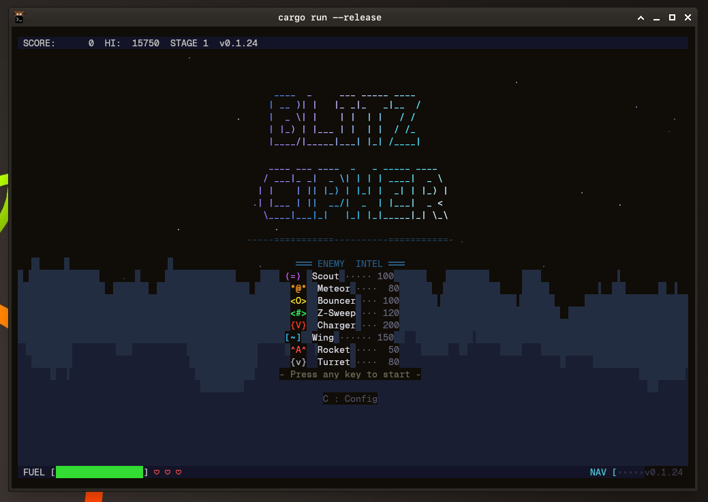
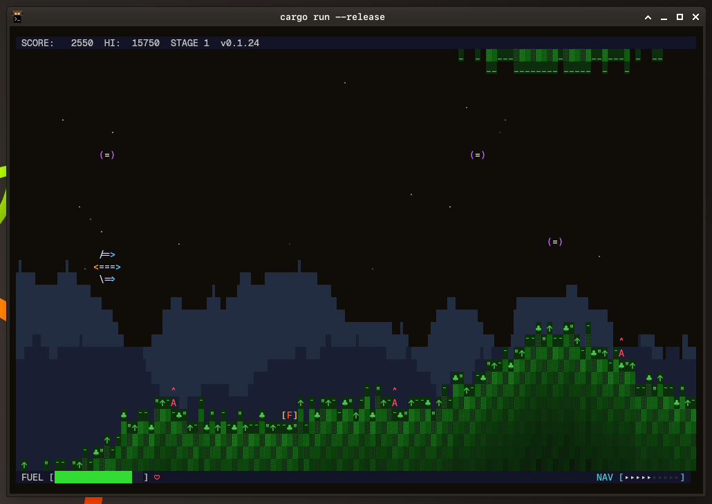
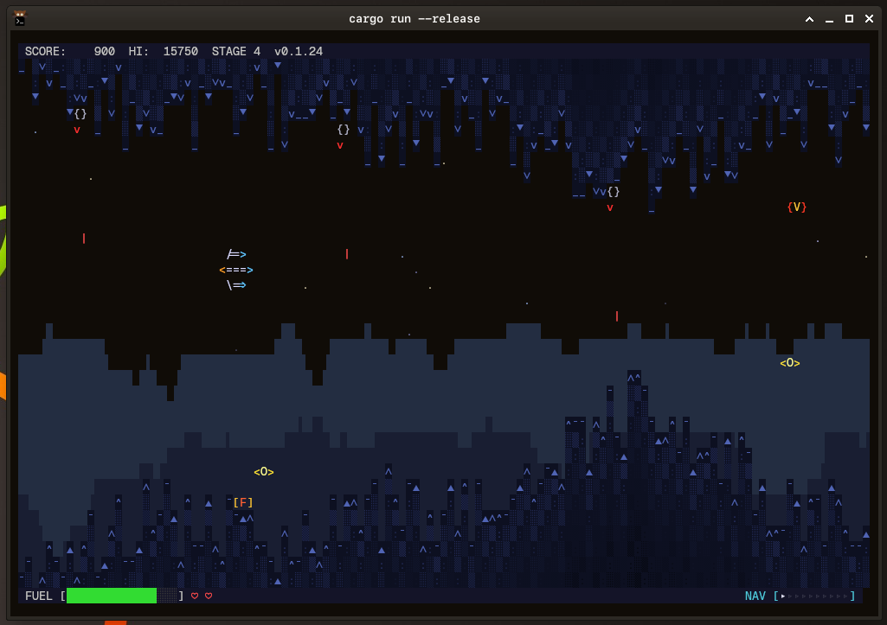
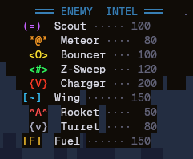

# Blitz Cipher

A retro side-scrolling shoot-em-up for the terminal, written in Rust.



## The Story

The year is 2187. Earth's deep-space relay network — the Cipher Array — has
gone dark. Thirty-six orbital stations that once kept humanity connected across
the colonies fell silent in a single night. No distress calls. No warnings.
Just static.

Recon drones sent to investigate were met by waves of unidentified craft
swarming through the relay corridors. Ground-based rocket batteries had been
hijacked and turned outward. The stations' own defence turrets, reprogrammed.
Whatever took the Array didn't just occupy it — it fortified it.

You are the pilot of the last Blitz-class interceptor, a stripped-down
fighter built for speed and precision. Your mission: punch through six
increasingly hostile sectors — from the open sky above the relay grounds,
through mountain passes and underground cavern networks, past fuel depots
rigged with defences, and into the heart of the enemy base itself.

Fuel is scarce. Enemies are relentless. The Array must be reclaimed.

Good luck, pilot. Cipher Control out.

## Gameplay


*Stage 1 — Open sky over the relay grounds. Rockets line the hills while scouts and meteors fill the air.*


*Stage 4 — Deep in the narrow caves. Turrets cling to ceiling and floor while chargers and bouncers swarm the corridors.*

## Enemies



Each enemy type has a distinct attack pattern:

| Enemy | Look | Behaviour |
|-------|------|-----------|
| **Scout** | `(=)` | Drifts in sine waves — predictable but numerous |
| **Meteor** | `*@*` | Plunges from the top of the screen at speed |
| **Bouncer** | `<O>` | Ricochets off ceiling and floor |
| **Z-Sweep** | `<#>` | Sweeps in sharp zigzag patterns across the screen |
| **Charger** | `{V}` | Locks onto your position and rushes forward — fast and aggressive |
| **Wing** | `[~]` | Flies in formation waves with swooping arcs |
| **Rocket** | `^A^` | Ground-based launcher, fires upward |
| **Turret** | `{v}` | Mounted on walls, tracks and fires at the player |
| **Fuel** | `[F]` | Not an enemy — grab these to keep flying |

## Running

```sh
cargo run --release
```

## Controls

- **Arrow keys / WASD** — Move
- **Space / Z** — Fire
- **C** — Config menu
- **Esc** — Quit

Gamepad supported.

## Version

v0.1.24
